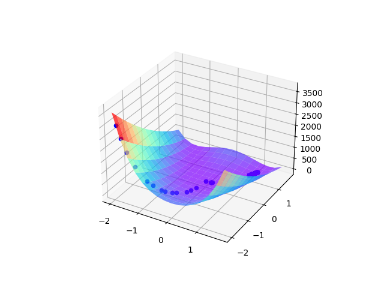
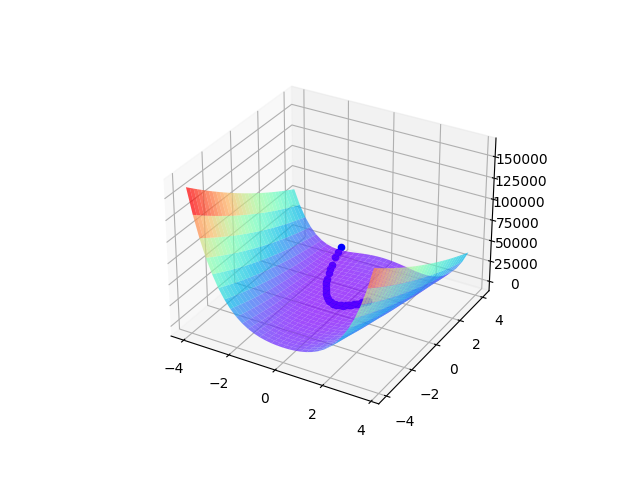

# Optimization
> The project is for practicing some basic optimization methods that I have learned in ***Numerical Optimization***

- gradient descent
  

  
- newton method

- trust region method
- conjugate gradient method
- quasi-newton method
- ...